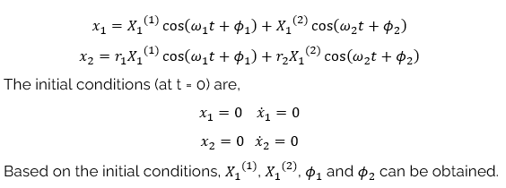
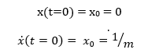

### Theory

Impulse force can be defined as a force that has large magnitude and acts for a short time. It can be measured by finding the change it causes in the momentum of system.
  
Impulse = F&delta;T = m $\dot x$2 - m $\dot x$1 

The initial conditions are given by

x(t=0) = x0 = 0

$\dot x$(t=0) = $\dot x$0 = 1/m

The displacement for the masses are calculated as,

<h3>The equation for the experiment is as follows</h3>

The X1 and X2 are the  static amplitudes 

The x1 and x2 are the dynamic amplitudes which is the cos function of time

the x10 and x20 is the initial amplitude

the x1d and x2d is the initial velocity  assumption  which is 0 in this case

