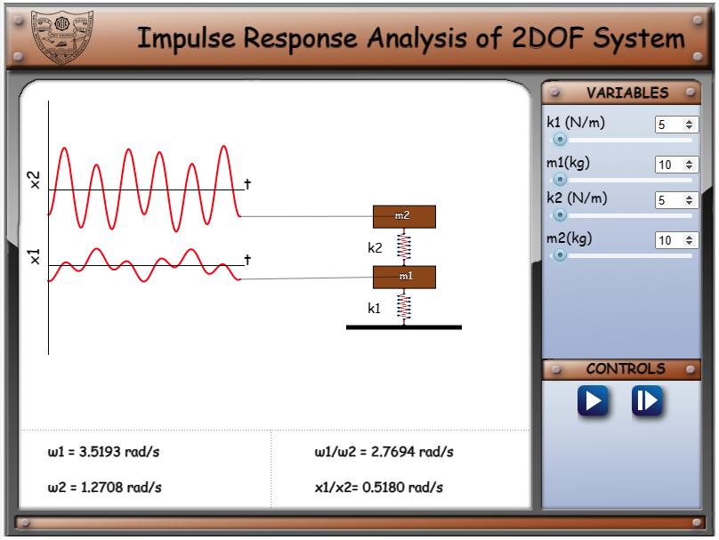
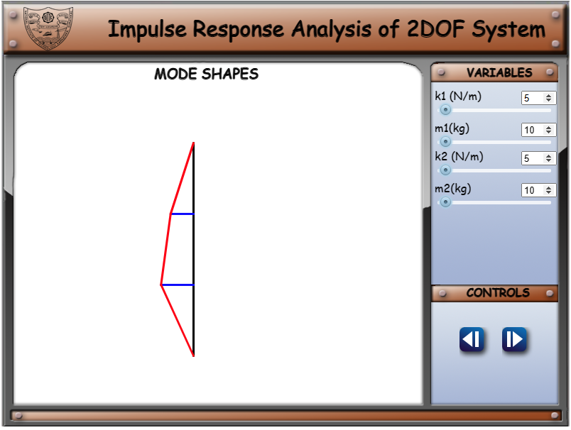
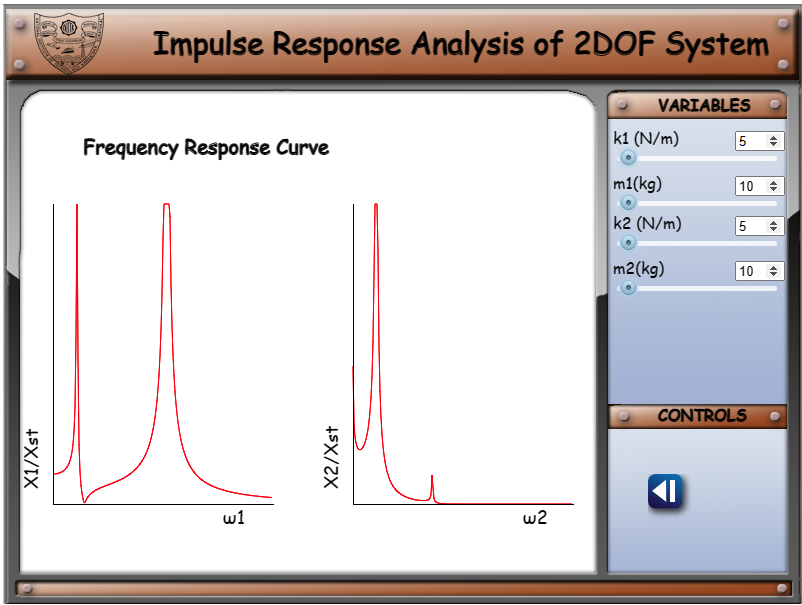

Given data:

k1 - stiffness of mass 1 (N/m)  
m1 - mass 1 (kg)  
k2 - stiffness of mass 2 (N/m)  
m2 - mass 2 (kg)  

For a constant value of impulse force, different responses can be observed by varying the masses m1 and m2 and stiffness k1 and k2.
1. On clicking the simulation tab, the first page is displayed as shown below.

Here, the user can set k1, m1, k2 and m2, which will vary the response of the system.

 

2. On clicking the next button, the mode shapes will be displayed, while the simulation is running.

 

3. The third page shows the frequency response curves.

