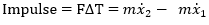
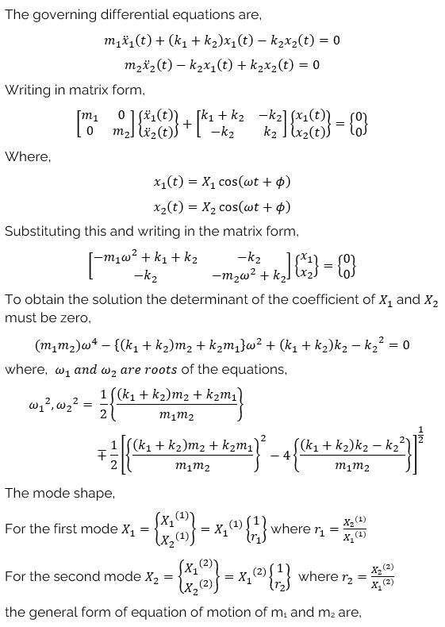

 Impulse force can be defined as a large magnitude force that acts for a short time. 

An example of an Impulse force is a blast load applied on top of a building. For this experiment, a building with two floors is considered. A blast load is a load applied on the structure which comes immediately after an explosion. It combines overpressure and impulse which lasts for a short duration of time.

The response of the structure due to the impulse load is influenced by the stiffness and mass of the structure. However, the stiffness and mass of the structures are influenced by the nature of construction and materials used.

The magnitude of the impulse force can be calculated by the impulse momentum principle.

The initial conditions are given by

